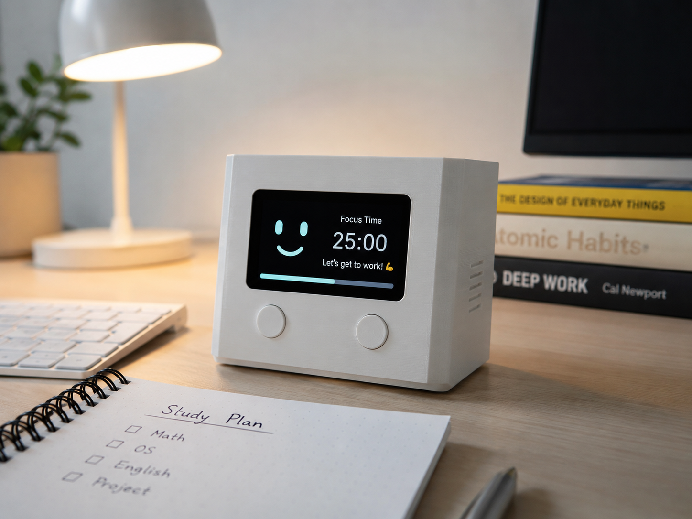

# Desk_Buddy

DeskBuddy is a compact desk buddy built with Raspberry Pi 4.  
It is designed to make studying more engaging by combining simple hardware controls with a friendly interactive system.  
The device can start automatically on boot and respond through buttons, timing features, and visual output.  
This project explores the idea of turning a small embedded system into a helpful and expressive study partner.
It features ChatGPT API so you can talk smoothly with this robot

↑↑↑ This is my ideal Robot.

# Day1 progress

Today, I finally bought the display!
First step,I tried to show some text. but a little bit I fotgot how to code in Python. I have to remember and learn Python.
And then, I wanted to change the screen to another one. Unfortunately, it did not move another one.
Tomorrow, I want to introduce the button switch. It can be more reality.

# Item

・Display : https://ssci.to/10138
・Raspberry pi 5 : https://ssci.to/9250
